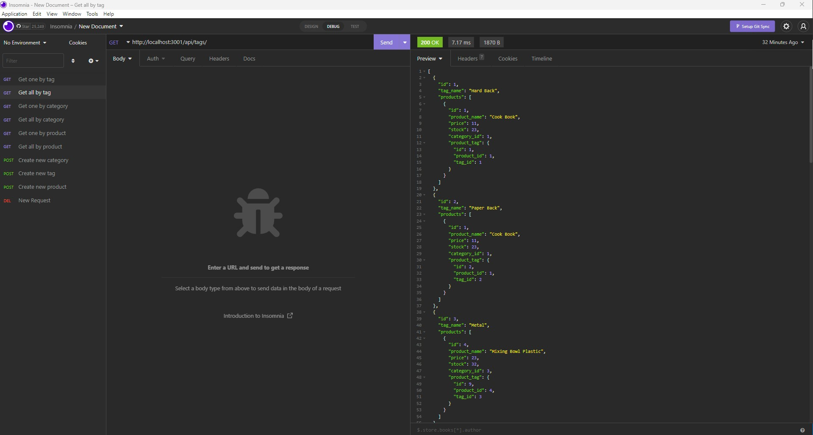

# Back end E-commerce 
## To show how the server side of e commerce works
### Table of Contents
- [Project Discription](#Discription)
- [Useage](#Useage)
- [Installation](#Installation)
- [Contributions](#Constributions)
- [Licence](#Licence)
- [Email](#Questions)
- [github](#Questions)

## Discription
This program when launched creates a server which the user can interact with via insomnia.

## Useage 
This program is intended to be used as a proof of concept for database construction using mysql

## Installation
To use the server the user must first make sure that the mysql database is working by using "mysql -u root -p" and entering their password. Once this is done the user must use the command "source db/schema.sql" this will create the database. Once this is done the user can use the command "quit" to leave sql. To populate the database the use must use the command "npm run seed". Once this is done the user can run the server using "npm start".

On a side note the user must create an .env file and populate it with the database name their mysql user name and their password for the database to start.

## Contributions 
I am the main contributor.

## Licence 

## Questions 
For any further questions that are not addressed in  this README please find my email and github below

### email: jbbalshaw@gmail.com
### github: 

## ScreenShots
